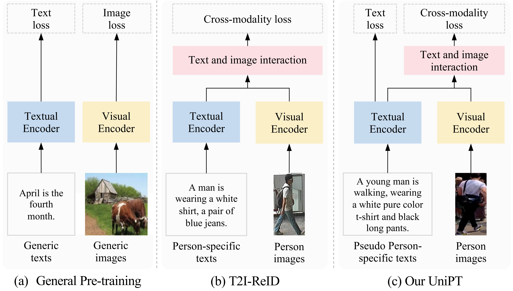

# UniPT

Code for the ICCV 2023 paper: "[Unified Pre-training with Pseudo Texts for Text-To-Image Person Re-identification](https://arxiv.org/pdf/2309.01420.pdf)"

---

  

## LUPerson-T which we proposed
You can download LUPerson-T at [https://pan.baidu.com/s/1k8Z_pm2nctl12LXSypaqGw](https://pan.baidu.com/s/16hrzG6498HQs40gMozGAzA) with hmyb

## Pre-training
We will update the code as soon as possible.
